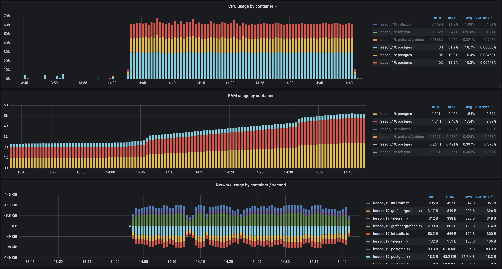
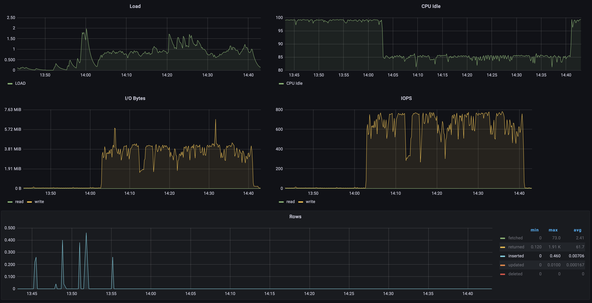
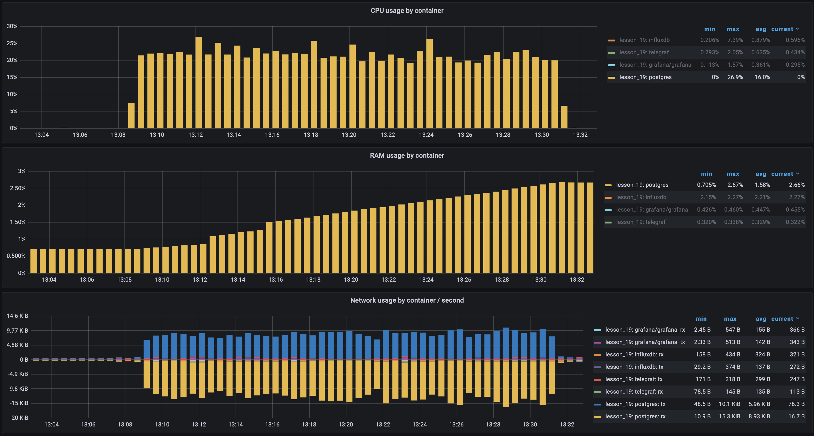
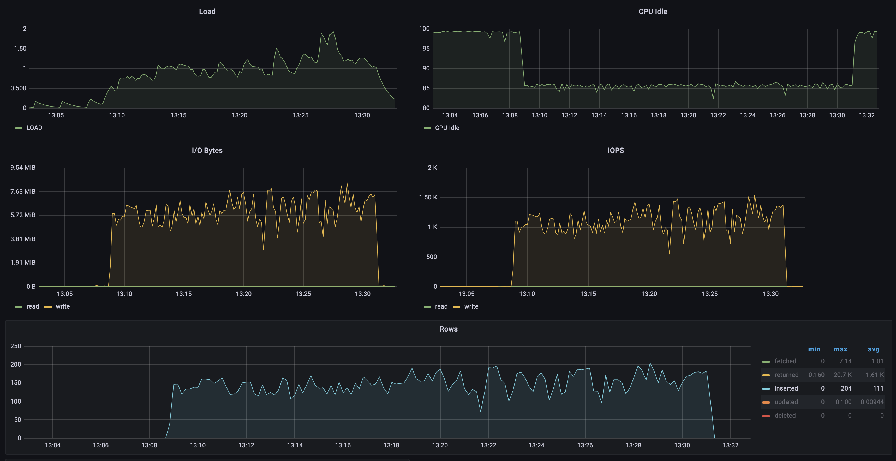
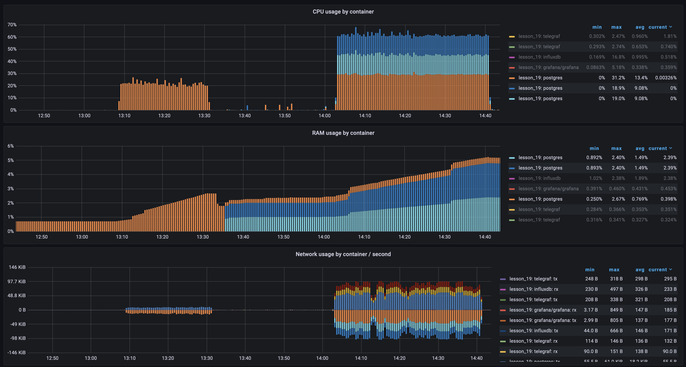
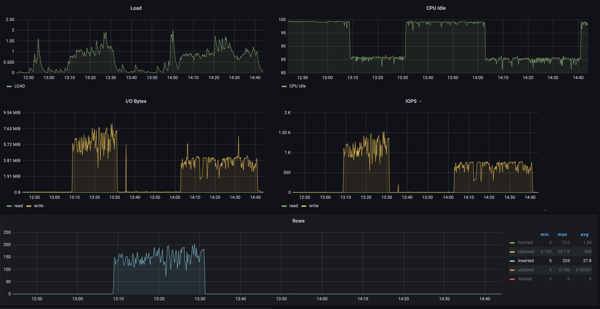

# Lesson 19

## Shard server

Setup

```postgresql
CREATE TABLE books
(
    id          bigint            not null,
    category_id int               not null,
    CONSTRAINT category_id_check CHECK ( category_id = 1 ),
    author      character varying not null,
    title       character varying not null,
    year        int               not null
);
```

## Main server

Add SERVER and MAPPING

```postgresql
CREATE
    EXTENSION postgres_fdw;
CREATE
    SERVER books_1_server
    FOREIGN DATA WRAPPER postgres_fdw
    OPTIONS ( host '172.23.0.5', port '5432', dbname 'mydb' );

CREATE
    USER MAPPING FOR CURRENT_USER
    SERVER books_1_server
    OPTIONS (user 'db_usr', password 'db_pwd');
```

Create foreign table

```postgresql
CREATE
    FOREIGN TABLE books_1 (
        id bigint not null,
        category_id int not null,
        author character varying not null,
        title character varying not null,
        year int not null )
    SERVER books_1_server
    OPTIONS (schema_name 'public', table_name 'books');
```

Create a View and Setup Rules

```postgresql
CREATE VIEW books AS
SELECT *
FROM books_1
UNION ALL
SELECT *
FROM books_2;

CREATE
    RULE books_insert AS ON INSERT TO books
    DO INSTEAD NOTHING;
CREATE
    RULE books_update AS ON
    UPDATE TO books
    DO INSTEAD NOTHING;
CREATE
    RULE books_delete AS ON DELETE
    TO books
    DO INSTEAD NOTHING;

CREATE
    RULE books_insert_to_1 AS ON INSERT TO books
    WHERE (category_id = 1)
    DO INSTEAD INSERT INTO books_1
               VALUES (NEW.*);

CREATE
    RULE books_insert_to_2 AS ON INSERT TO books
    WHERE (category_id = 2)
    DO INSTEAD INSERT INTO books_2
               VALUES (NEW.*);
```

## Insert 1 000 000 rows into books with sharding

Time 2289.37 seconds ~ 38 min

### CPU & RAM & Network used by container 


### Postrges param


## Insert 1 000 000 rows into books without sharding

Time 1337.23 seconds ~ 22 min

### CPU & RAM & Network used by container 


### Postrges param


## Compare performance

### CPU & RAM & Network used by container 


### Postrges param


