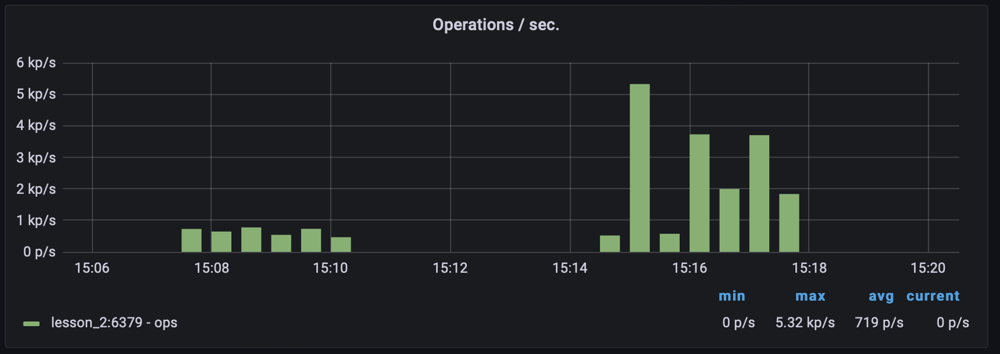

# Lesson 4

## Setup

Run application
```shell
docker-compose up -d
cd aplication
uvicorn main:app --reload
```

Run test 
```shell
siege -c25 -v -t180s -f get_url.txt
```

By default the range starts from 49152 (net.inet.ip.portrange.first) 
and ends to 65535 (net.inet.ip.portrange.last). That is, 65535 - 49152 = 16383.

You can make the ephemeral port range starting from 32768:
```shell
sudo sysctl -w net.inet.ip.portrange.first=32768
```
https://stackoverflow.com/questions/55366733/increasing-limit-of-outgoing-tcp-connections-on-macos


## Results

### Resource availability

| Concurrent                | 10     | 25     | 50     | 100    |
|---------------------------|--------|--------|--------|--------|
| Without cache             | 100.00 | 100.00 | 100.00 | 100.00 |
| With simple cache         | 100.00 | 100.00 | 100.00 | 100.00 |
| With  probabilistic cache | 100.00 | 100.00 | 100.00 | 100.00 |

### Avg response time

| Concurrent                | 10   | 25   | 50   | 100  |
|---------------------------|------|------|------|------|
| Without cache             | 0.66 | 0.66 | 0.76 | 0.73 |
| With simple cache         | 0.03 | 0.08 | 0.17 | 0.16 |
| With  probabilistic cache | 0.03 | 0.08 | 0.17 | 0.17 |

### Throughput

| Concurrent                | 10   | 25   | 50   | 100  |
|---------------------------|------|------|------|------|
| Without cache             | 0.00 | 0.00 | 0.00 | 0.00 |
| With simple cache         | 0.03 | 0.03 | 0.03 | 0.06 |
| With  probabilistic cache | 0.03 | 0.03 | 0.03 | 0.06 |

### Transactions

| Concurrent                | 10    | 25    | 50    | 100    |
|---------------------------|-------|-------|-------|--------|
| Without cache             | 2723  | 6798  | 10892 | 10836  |
| With simple cache         | 57128 | 58315 | 52191 | 113402 |
| With  probabilistic cache | 56841 | 57322 | 51884 | 107161 |

> **_NOTE:_**  As you can see from the table with the number of 
> transactions, the application without cache has reached its 
> limit and could process more than 11,000 transactions.

## Comparison simple cache vs. probabilistic cache

When using a simple cache, we see that queries to the database have 
pronounced peaks. At the same time, when using a probabilistic cache, 
the database query diagram is smoother.

First launched with a simple cache, then with a probabilistic cache


But when using a probabilistic cache, redis is much more loaded.

